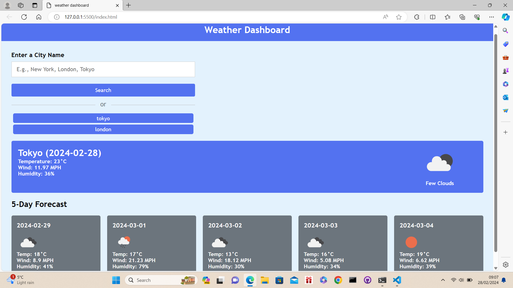

# 6th-Challenge-Weather-Dashboard

## What was my project objective and what have i accomplished?
In this project i was tasked with creating a fully functioning weather dashboard which i have sucessfully done by ensuring that when a city name for example, London is entered into the text box and the search button is pressed that the current weather as well as a five day forecast is then presented on the page. I have also ensured that each day that is presented on the weather dashboard shows the temperature, wind speed, the humidity and that an icon shows what the weather prediction is. For example if it is expected to rain an icon of a raining cloud is displayed.

I was also tasked with ensuring that once a city name is entered that it is then added to a recent search area so that the user is able to quickly click back on their previous search if they need to do so which i have sucessfully been able to do by ensuring that when a previous search is clicked the user is then presented with all of the weather information for that city.

